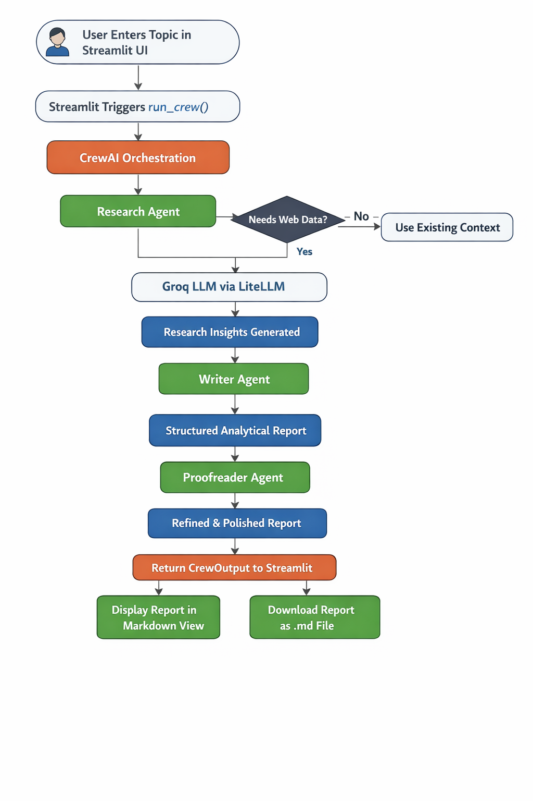
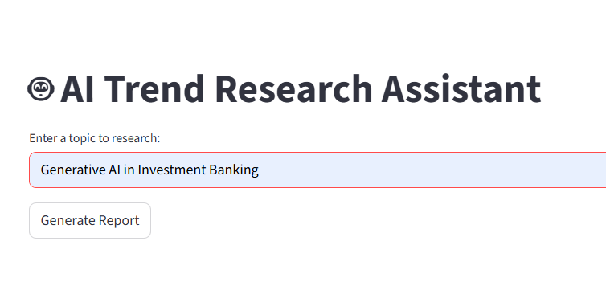
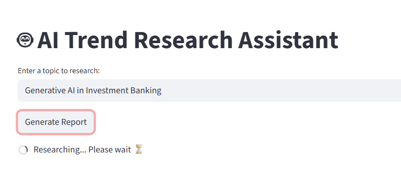
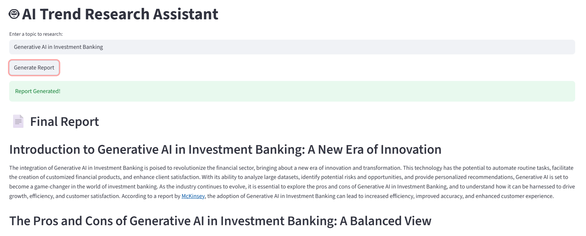
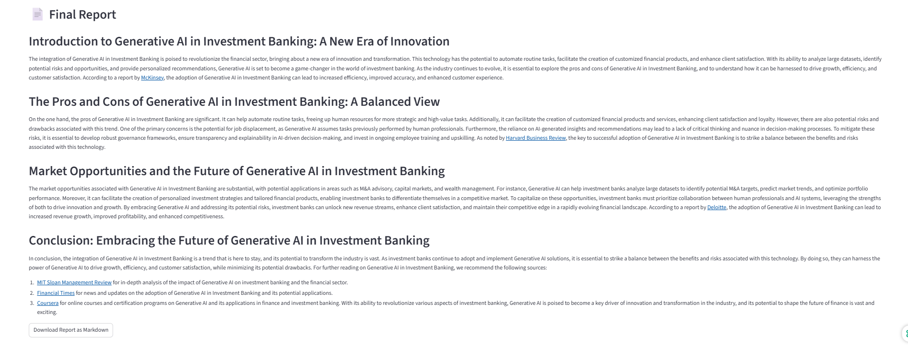
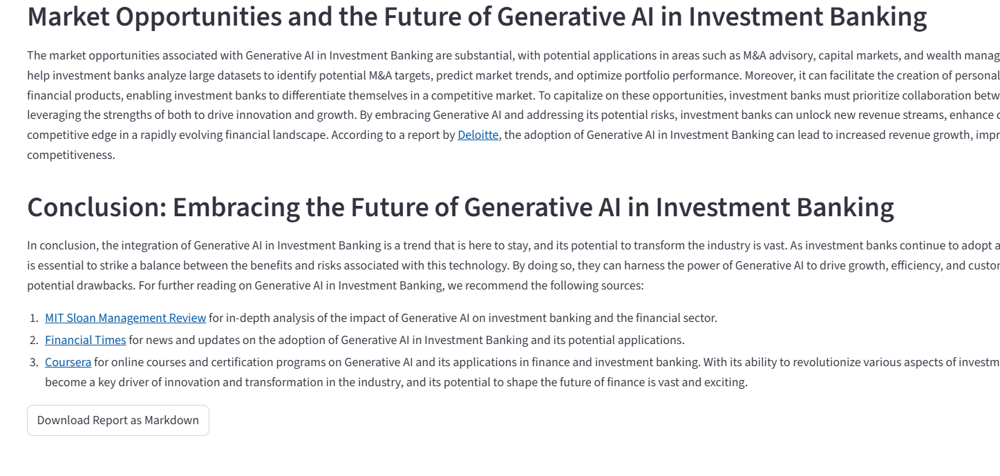

# 🤖 AI Trend Intelligence Assistant

An AI-powered multi-agent research assistant built using CrewAI, Groq LLM, SerperDev, LiteLLM, and Streamlit.

This project demonstrates a real-world implementation of a tool-augmented, multi-agent AI system that performs intelligent trend research, structured report writing, and automated proofreading — all accessible through a clean Streamlit interface.
 
---

# 🏗️ Project Architecture

Below is the system flowchart illustrating the complete execution lifecycle of the application:

---

## 🔄 How the System Works

The application follows a layered architecture with clear separation between the UI, orchestration layer, tools, and LLM execution.

### 1️⃣ User Interface – Streamlit

- The user enters a research topic.
- Clicking **Generate Report** triggers the backend process.
- The final report is displayed in formatted Markdown.
- Users can download the generated report as a `.md` file.

Streamlit acts purely as the presentation layer.

---

### 2️⃣ Orchestration Layer – CrewAI

The backend logic is handled by **CrewAI**, which manages a sequential multi-agent workflow.

The crew consists of:

- **Research Agent**
- **Writer Agent**
- **Proofreader Agent**

Each agent executes in order, and the output of one becomes the input for the next.

Flow:
Research → Write → Proofread

CrewAI handles:
- Task sequencing
- Context propagation
- Tool access
- LLM communication

---

### 3️⃣ Tool-Augmented Research – SerperDev

The Research Agent is integrated with the **SerperDev search API**.

Instead of relying only on the LLM’s training data:

- The agent can query SerperDev
- Retrieve real-time web search results
- Inject fresh data into the LLM prompt
- Generate up-to-date insights

This transforms the system into a **tool-augmented intelligent agent** capable of grounded research.

---

### 4️⃣ Model Abstraction – LiteLLM

CrewAI does not directly call Groq.

Instead:

CrewAI → LiteLLM → Groq API

LiteLLM provides:
- Unified model interface
- Easy provider switching
- Clean abstraction layer

This design allows switching to OpenAI, Anthropic, etc., without modifying agent logic.

---

### 5️⃣ High-Performance Inference – Groq

Groq handles:
- LLM inference
- Fast response generation
- Processing of tool-augmented prompts

The model generates:
- Research insights
- Structured reports
- Refined polished outputs

---

## 📊 Complete Execution Flow

1. User enters topic in Streamlit.
2. Streamlit calls `run_crew()`.
3. CrewAI initializes agents.
4. Research Agent optionally calls SerperDev for web data.
5. Data is passed to Groq via LiteLLM.
6. Writer Agent structures the report.
7. Proofreader Agent refines it.
8. Final report is returned to Streamlit.
9. Report is displayed in Markdown.
10. User can download the report as a `.md` file.

---

# 🖥️ Application Screenshots

## 🔹 Application Interface

## 🔹 Generated Report View

---

# 🚀 Key Features

- Multi-Agent Architecture (CrewAI)
- Real-Time Web Search Integration (SerperDev)
- High-Speed LLM Inference (Groq)
- Model Abstraction Layer (LiteLLM)
- Interactive Web Interface (Streamlit)
- Markdown Report Generation
- Downloadable Research Reports

---

# 🧠 Architectural Highlights

This project demonstrates:

- Tool-Augmented AI Agents
- Sequential Multi-Agent Orchestration
- Separation of Concerns
- Modular LLM Integration
- Real-Time Data Enrichment
- Production-Ready Architecture Pattern

---

# 🏁 Conclusion

This project showcases a complete AI research automation pipeline combining:

- Multi-agent intelligence
- Tool-based real-time augmentation
- High-performance LLM execution
- Clean UI integration
- Downloadable analytical outputs

It serves as a strong foundation for building advanced AI research assistants, SaaS AI tools, or enterprise-grade automation systems.